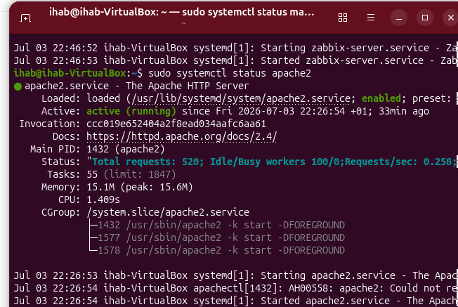
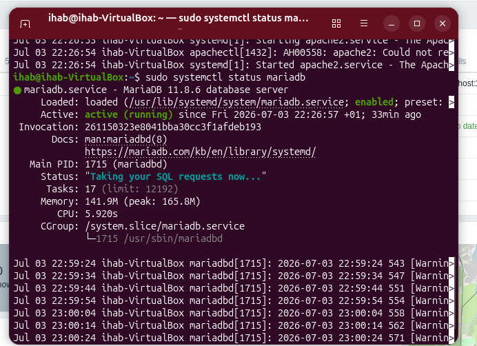
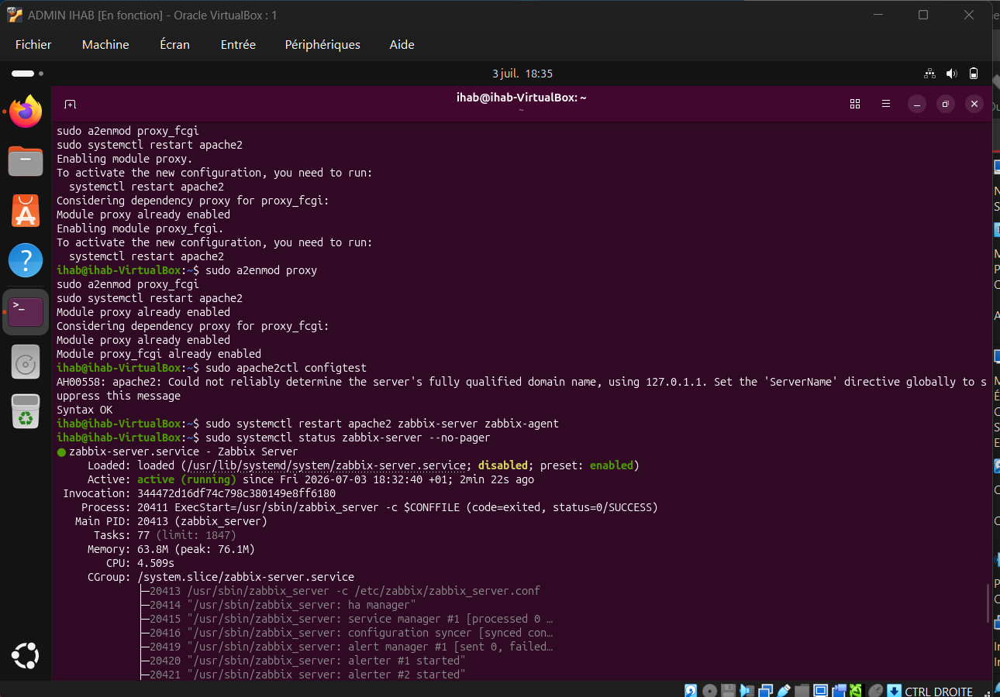
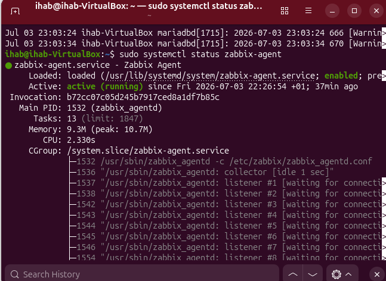
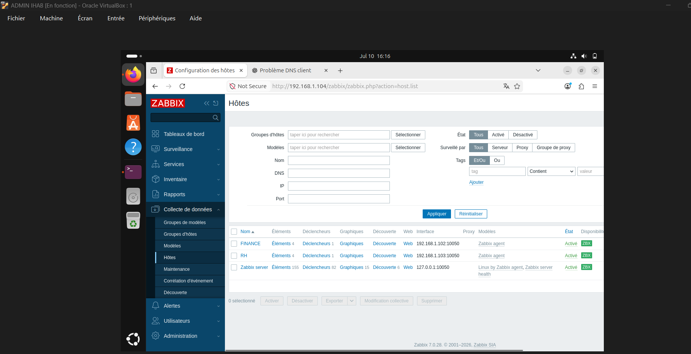
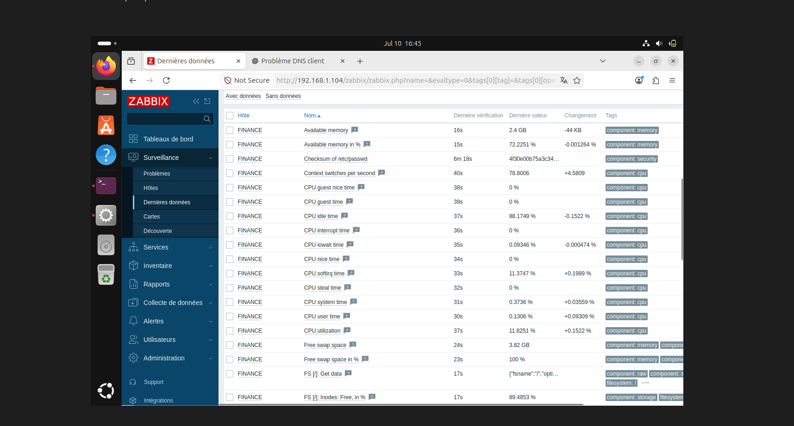
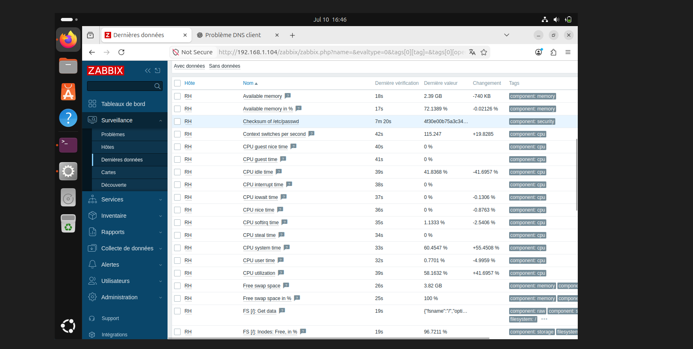
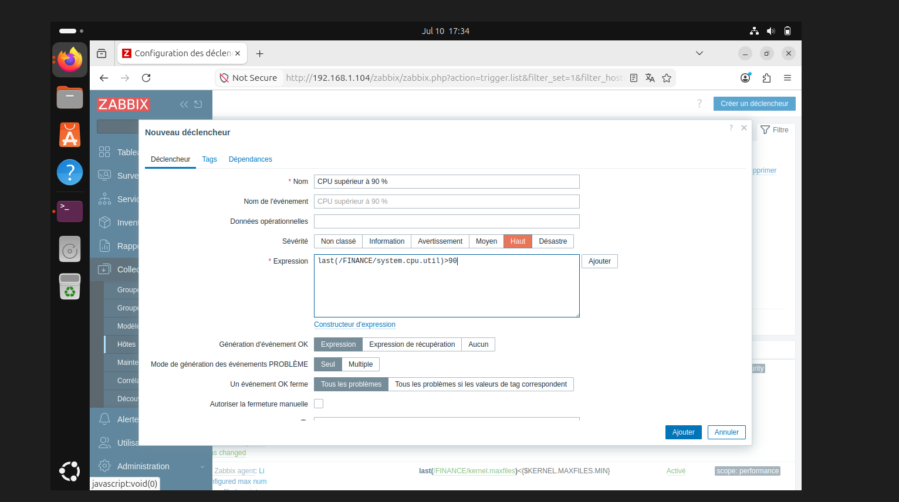
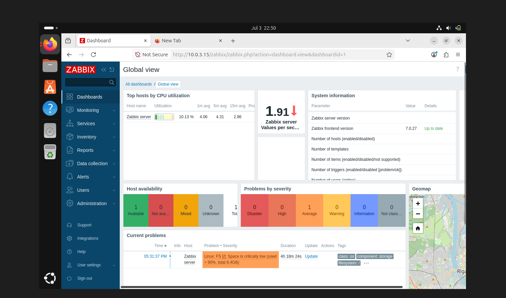

# Zabbix Network Monitoring

## 📖 Project Overview

This project demonstrates the deployment of **Zabbix 7.0** on Ubuntu for monitoring Linux servers in a virtual environment.

The monitoring platform supervises CPU, memory, disk usage and automatically executes a remediation script when CPU utilization exceeds 90%.

---

# Project Architecture

```
                +----------------------+
                |    Zabbix Server     |
                |   Ubuntu 24.04 LTS   |
                | Apache2 + MariaDB    |
                +----------+-----------+
                           |
        -----------------------------------------
        |                                       |
+-------------------+                  +-------------------+
|   RH Client       |                  |  FINANCE Client   |
| Ubuntu + Agent    |                  | Ubuntu + Agent    |
+-------------------+                  +-------------------+
```

---

# Features

- Install Zabbix Server
- Configure Apache2
- Configure MariaDB
- Install Zabbix Agent
- Add monitored hosts
- CPU Monitoring
- Memory Monitoring
- Disk Monitoring
- Trigger creation
- Automatic CPU remediation
- Automatic action execution
- Dashboard monitoring

---

# Services Verification

## Apache2



---

## MariaDB



---

## Zabbix Server



---

## Zabbix Agent



---

# Hosts Configuration



---

# System Monitoring

## FINANCE



---

## RH



---

# CPU Trigger



---

# Automatic Remediation Script


---

# Automatic Action


---

# CPU Alert


---

# Automatic Resolution


---

# Dashboard


---

# Technologies

- Ubuntu Linux
- Zabbix 7.0
- Apache2
- MariaDB
- PHP
- Bash
- Oracle VirtualBox

