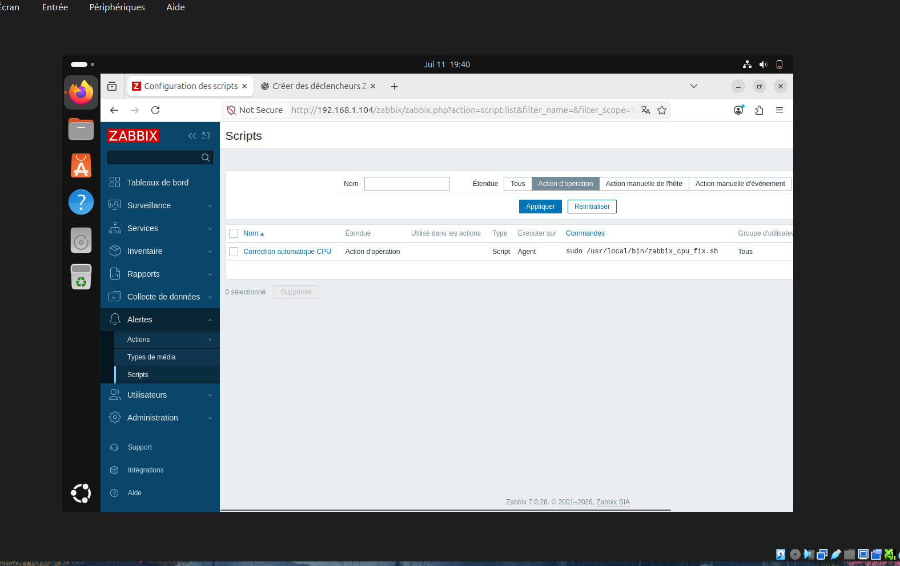
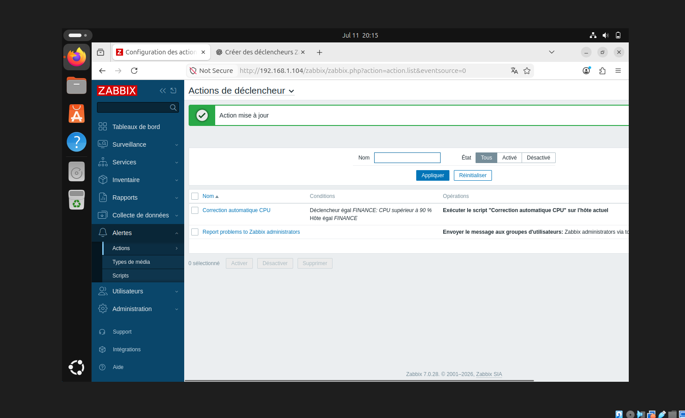
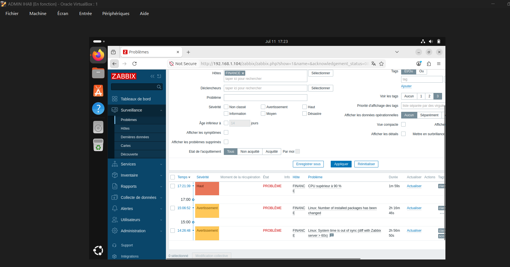
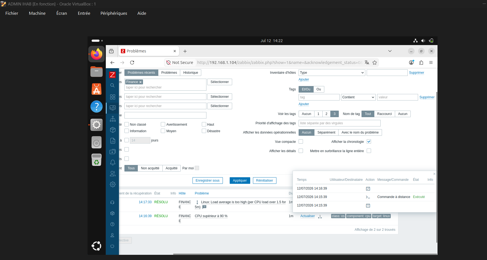
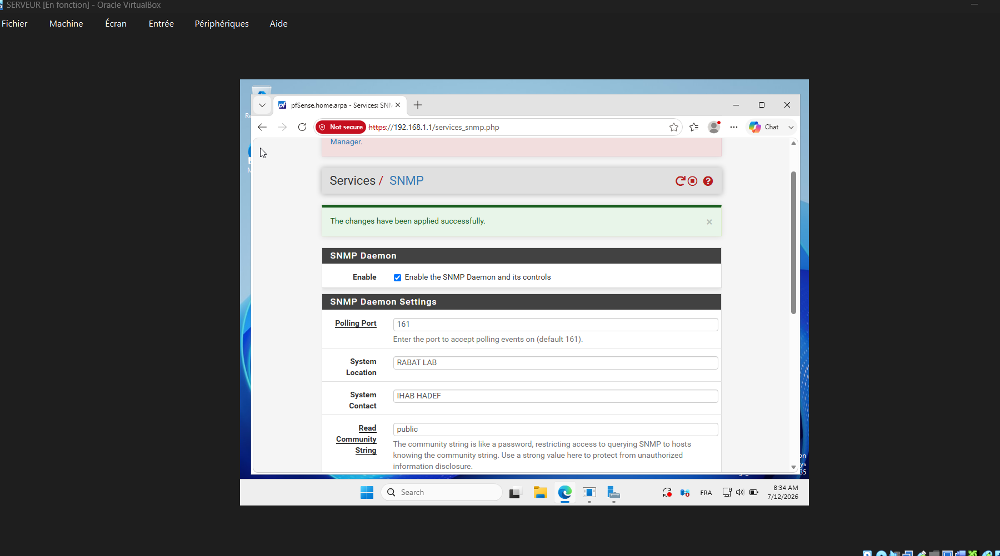
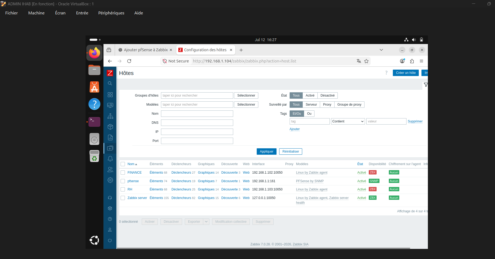

# Projet de Supervision Réseau avec Zabbix

## À propos du projet

Ce projet présente le déploiement et la configuration d'une infrastructure complète de supervision réseau à l'aide de **Zabbix 7.0** dans un environnement virtualisé.

L'objectif est de simuler un réseau d'entreprise et de superviser en temps réel les serveurs, les postes clients ainsi que les équipements réseau. L'infrastructure comprend un serveur Zabbix, un pare-feu pfSense, un serveur Windows fournissant les services DNS et DHCP, ainsi que deux clients Ubuntu représentant les départements RH et Finance.

---

## Objectifs du projet

- Installer et configurer **Zabbix Server 7.0** sur Ubuntu.
- Configurer **Apache2** et **MariaDB**.
- Déployer un serveur **Windows Server** avec les services **DNS** et **DHCP**.
- Installer et configurer les **agents Zabbix** sur les clients Linux.
- Superviser le pare-feu **pfSense** via le protocole **SNMP**.
- Surveiller les ressources système (CPU, mémoire, disque).
- Contrôler la disponibilité des machines grâce au protocole **ICMP (Ping)**.
- Créer des déclencheurs (Triggers) et des alertes automatiques.
- Automatiser certaines actions grâce à des scripts Bash.
- Centraliser la supervision à l'aide de tableaux de bord et de graphiques.

---

## Infrastructure du projet

L'infrastructure est composée des machines virtuelles suivantes :

- **Serveur Zabbix** (Ubuntu)
- **Serveur Windows** (DNS et DHCP)
- **Pare-feu pfSense**
- **Client Ubuntu - RH**
- **Client Ubuntu - Finance**

Toutes les machines sont déployées et configurées dans **Oracle VirtualBox**.

---

## Fonctionnalités réalisées

- Installation et configuration de Zabbix Server
- Configuration d'Apache2 et MariaDB
- Configuration du serveur DNS et DHCP
- Connexion des clients Linux au serveur Zabbix
- Supervision du pare-feu pfSense via SNMP
- Surveillance du processeur (CPU)
- Surveillance de la mémoire (RAM)
- Surveillance de l'espace disque
- Surveillance de la disponibilité des machines (ICMP)
- Création de déclencheurs personnalisés
- Alertes automatiques
- Exécution automatique de scripts Bash
- Tableau de bord de supervision en temps réel

---

## Technologies utilisées

- Zabbix 7.0
- Ubuntu Linux
- Windows Server
- pfSense CE 2.7.2
- SNMP
- ICMP
- Zabbix Agent
- Apache2
- MariaDB
- Bash
- Oracle VirtualBox

---

## Architecture du projet

```text
                    Internet
                        │
                  ┌────────────┐
                  │  pfSense   │
                  └─────┬──────┘
                        │
        ┌───────────────┼────────────────┐
        │               │                │
 ┌────────────┐  ┌────────────┐  ┌────────────┐
 │Windows     │  │Client RH   │  │Client      │
 │Server      │  │Ubuntu      │  │Finance     │
 │DNS / DHCP  │  │Zabbix Agent│  │Zabbix Agent│
 └────────────┘  └────────────┘  └────────────┘
                        │
                 ┌──────────────┐
                 │ Zabbix Server│
                 │    Ubuntu    │
                 └──────────────┘
```
## Captures d'écran

### Dashboard

Le tableau de bord Zabbix affiche une vue d'ensemble de l'infrastructure supervisée, permettant de visualiser rapidement l'état des hôtes, les problèmes détectés et les principales métriques du système.


---

### Zabbix Hosts

Cette capture présente les différents hôtes supervisés par Zabbix, notamment les clients Linux (RH et Finance), le serveur Zabbix ainsi que le pare-feu pfSense connecté via SNMP.


---

### FINANCE Monitoring

Le client **Finance** est supervisé grâce à l'agent Zabbix. Les ressources système telles que le processeur, la mémoire et l'espace disque sont collectées en temps réel.


---

### RH Monitoring

Le client **RH** est également supervisé via l'agent Zabbix afin de surveiller les performances et la disponibilité de la machine.


---

### CPU Trigger

Création d'un déclencheur personnalisé permettant de détecter automatiquement une utilisation élevée du processeur.


---

### Automatic CPU Script

Script Bash développé pour effectuer automatiquement une action lorsque l'utilisation du processeur dépasse le seuil défini.



---

### Automatic Action

Configuration d'une action automatique dans Zabbix afin d'exécuter le script lors du déclenchement d'une alerte CPU.



---

### CPU Alert

Détection automatique d'une surcharge CPU grâce au déclencheur configuré dans Zabbix.



---

### Automatic Resolution

Résolution automatique du problème CPU après l'exécution du script de correction.



---

### Apache2 Service

Vérification du bon fonctionnement du service **Apache2** supervisé par Zabbix.


---

### MariaDB Service

Contrôle de l'état du service **MariaDB** afin de garantir le bon fonctionnement de la base de données Zabbix.


---

### Zabbix Server Service

Surveillance du service **Zabbix Server** pour vérifier son bon fonctionnement.


---

### SNMP Configuration on pfSense

Configuration du service **SNMP** sur pfSense, incluant la communauté SNMP, le port 161 et l'interface LAN utilisée pour la supervision.



---

### pfSense Added to Zabbix via SNMP

Le pare-feu **pfSense** est ajouté avec succès au serveur Zabbix et supervisé via **SNMP**, permettant de surveiller son état et ses performances en temps réel.



---

### Zabbix Agent Service

Vérification que le service **Zabbix Agent** est actif et communique correctement avec le serveur Zabbix.


## Résultats obtenus

À la fin de ce projet, l'ensemble des équipements est correctement supervisé depuis Zabbix :

- Les clients Linux communiquent avec le serveur Zabbix via **Zabbix Agent**.
- Le pare-feu **pfSense** est supervisé via **SNMP**.
- Les ressources système (CPU, RAM et disque) sont surveillées en temps réel.
- Les alertes sont générées automatiquement lors d'un dépassement de seuil.
- Des actions automatiques peuvent être exécutées grâce à des scripts Bash.
- Les tableaux de bord permettent de visualiser l'état global de l'infrastructure.
